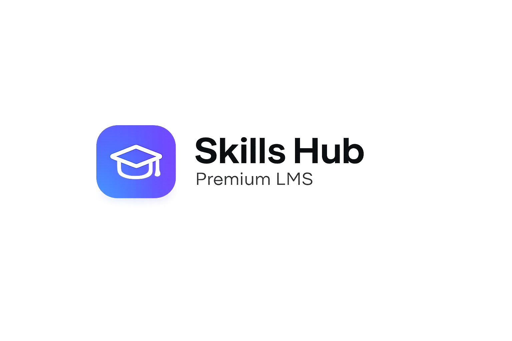

# 🎓 Skills Hub LMS

<p align="center">
  
</p>

<h2 align="center">Learn. Build. Grow.</h2>

<p align="center">
A modern, scalable, and responsive Learning Management System (LMS) built with <strong>Next.js</strong>, <strong>React</strong>, <strong>Firebase</strong>, <strong>Tailwind CSS</strong>, and <strong>shadcn/ui</strong>.
</p>

<p align="center">
Empowering students with premium learning experiences while providing administrators with powerful course management tools.
</p>

---

## ✨ Overview

**Skills Hub LMS** is a next-generation online learning platform designed for students, instructors, and educational businesses.

The platform focuses on practical learning, modern UI/UX, responsive design, secure authentication, and scalable architecture.

Whether you're learning programming, AI, web development, or professional skills, Skills Hub LMS provides an engaging learning experience across all devices.

---

# 🚀 Features

### 👨‍🎓 Student Features

* Secure Authentication
* Beautiful Dashboard
* Browse Premium Courses
* Course Categories
* Responsive Video Lessons
* Progress Tracking
* Certificates
* Wishlist
* Course Reviews
* Search & Filter
* Dark Mode
* Mobile Friendly

---

### 👨‍💼 Admin Features

* Admin Dashboard
* Course Management
* Student Management
* Instructor Management
* Analytics Dashboard
* Category Management
* Upload Lessons
* Manage Enrollments
* User Roles
* Firebase Integration

---

### 🎨 UI Features

* Premium SaaS Design
* Responsive Layout
* Modern Components
* Glassmorphism
* Dark / Light Theme
* Smooth Animations
* Accessible UI
* Optimized Performance

---

# 🛠 Tech Stack

| Category       | Technology                 |
| -------------- | -------------------------- |
| Framework      | Next.js 16                 |
| Library        | React 19                   |
| Styling        | Tailwind CSS v4            |
| Components     | shadcn/ui                  |
| Icons          | Lucide React + React Icons |
| Authentication | Firebase Auth              |
| Database       | Cloud Firestore            |
| Storage        | Firebase Storage           |
| Forms          | React Hook Form            |
| Validation     | Zod                        |
| Theme          | next-themes                |
| Deployment     | Vercel                     |

---

# 📂 Project Structure

```text
src/
│
├── app/
├── components/
│   ├── layout/
│   ├── home/
│   ├── dashboard/
│   ├── course/
│   ├── auth/
│   └── ui/
│
├── hooks/
├── lib/
├── services/
├── utils/
├── context/
├── styles/
└── public/
```

---

# 📱 Responsive Design

* Desktop
* Laptop
* Tablet
* Mobile

Fully optimized for every screen size.

---

# 🔐 Authentication

* Email & Password Login
* Register Account
* Google Sign-In
* Forgot Password
* Protected Routes
* User Session Management

---

# 📚 Course Modules

* Web Development
* HTML & CSS
* JavaScript
* React
* Next.js
* Tailwind CSS
* Firebase
* Python
* Artificial Intelligence
* Chatbot Automation

---

# ⚡ Performance

* Fast Loading
* SEO Friendly
* Optimized Images
* Lazy Loading
* Code Splitting
* Server Rendering
* Accessibility Ready

---

# 💻 Installation

```bash
git clone https://github.com/zubairwebdeveloper/skillshub-lms.git

cd skillshub-lms

npm install

npm run dev
```

---

# 🌟 Future Roadmap

* Student Certificates
* Live Classes
* Assignments
* Quizzes
* AI Learning Assistant
* Instructor Panel
* Discussion Forum
* Notifications
* Payment Integration
* Course Marketplace
* Mobile App

---

# 🤝 Contributing

Contributions are always welcome.

1. Fork the repository.
2. Create a feature branch.
3. Commit your changes.
4. Push your branch.
5. Open a Pull Request.

---

# 📄 License

This project is licensed under the MIT License.

---

# ❤️ Built For

* Students
* Developers
* Instructors
* Educational Institutes
* Coding Academies
* Online Learning Platforms

---

# ⭐ Support

If you found this project helpful:

⭐ Star this repository

🍴 Fork the project

💡 Share your feedback

---

<p align="center">
Made with ❤️ using Next.js, React, Firebase, Tailwind CSS, and shadcn/ui.
</p>

<p align="center">
<strong>Skills Hub LMS</strong><br/>
Learn Today. Build Tomorrow.
</p>
